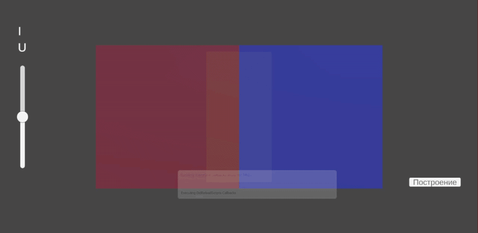

> Студент: Южаков А.А.
> 
> Группа: РИ-151122
>
> Преподаватель: Денисов Д.В.
---------------------------------------------------------

# Моделирование p-n перехода (Unity)

Интерактивная симуляция p-n перехода с визуализацией движения носителей заряда и построением вольт-амперной характеристики (ВАХ).

## 📌 Описание

Проект моделирует поведение p-n перехода на качественном уровне:

- движение электронов и дырок  
- диффузия и дрейф в электрическом поле  
- формирование обеднённой области  
- рекомбинация носителей  
- зависимость тока от напряжения  

Ток в системе оценивается как **количество рекомбинаций в единицу времени**.

---

## 🖥️ Интерфейс

Окно симуляции содержит:

- **Слайдер слева** — управление напряжением  
- **Текст сверху слева**:
  - `U` — текущее напряжение  
  - `I` — ток (число рекомбинаций в секунду)  
- **Центральная область**:
  - 🔴 красные частицы — дырки (P-область)
  - 🔵 синие частицы — электроны (N-область)
- **Кнопка справа** — запуск построения ВАХ  

---

## 🚀 Запуск проекта

1. Открыть проект в Unity (рекомендуется версия 2021 и выше)
2. Открыть сцену с симуляцией
3. Нажать **Play**

---

## 🎮 Управление

### Ручной режим
- Перемещайте слайдер напряжения
- Наблюдайте:
  - движение частиц
  - изменение тока

### Построение ВАХ
1. Нажмите кнопку **"Построение"**
2. Система автоматически:
   - изменяет напряжение в диапазоне -5V - 5V
   - измеряет ток
   - строит график

Во время построения ручное управление отключено.

---

## 🎬 Демонстрация
<p align="center">
  
</p>

---

## ⚙️ Архитектура

Проект состоит из двух основных компонентов:


### 1. `PNJunctionSimulation`

Отвечает за физическую симуляцию:

- генерация частиц
- движение (дрейф + диффузия)
- отталкивание частиц
- рекомбинация
- визуализация обеднённой области

**Ключевые параметры:**

| Параметр | Описание |
|--------|--------|
| `electronCount`, `holeCount` | количество частиц |
| `diffusionStrength` | сила диффузии |
| `thermalMotion` | случайное тепловое движение |
| `builtInField` | встроенное электрическое поле |
| `depletionWidth` | ширина обеднённой области |
| `recombinationDistance` | расстояние рекомбинации |

---

### 2. `VAHGraphBuilder`

Отвечает за интерфейс и построение ВАХ:

- управление напряжением
- отображение значений
- измерение тока
- построение графика через `LineRenderer`

**Ключевые параметры:**

| Параметр | Описание |
|--------|--------|
| `step` | шаг изменения напряжения |
| `measureTime` | время измерения тока |
| `scaleX`, `scaleY` | масштаб графика |
| `uiUpdateInterval` | интервал обновления UI |
| `stopThreshold` | порог остановки графика |

---

## 📈 Построение ВАХ

Алгоритм:

1. Напряжение изменяется от -5V до +5V
2. Для каждой точки:
   - система ждёт `measureTime`
   - считает число рекомбинаций
   - вычисляет ток:
     ```
     I = recombinationCounter / time
     ```
3. Значения сглаживаются (`Lerp`)
4. График строится по мере расчёта

### Особенности:
- при прямом смещении ток принудительно не убывает
- при насыщении (ограничение частиц) построение останавливается

---

## ⚠️ Ограничения модели

- модель **качественная, не количественная**
- ток не соответствует реальным амперам
- отсутствует точное решение уравнений полупроводниковой физики
- производительность падает при большом числе частиц (O(n²))

---

## 💡 Возможные улучшения

- оптимизация (Spatial hashing / ECS)
- более точная физическая модель
- добавление температуры
- визуализация электрического поля
- отображение графика в UI (Canvas)
- логарифмическая шкала

---

## 📚 Назначение

Проект подходит для:

- учебных демонстраций  
- лабораторных работ  
- визуализации работы p-n перехода  
- изучения поведения носителей заряда  

---

## 🧪 Примечание

Симуляция ориентирована на наглядность:

- движение частиц отражает физические процессы
- ВАХ формируется из динамики рекомбинации
